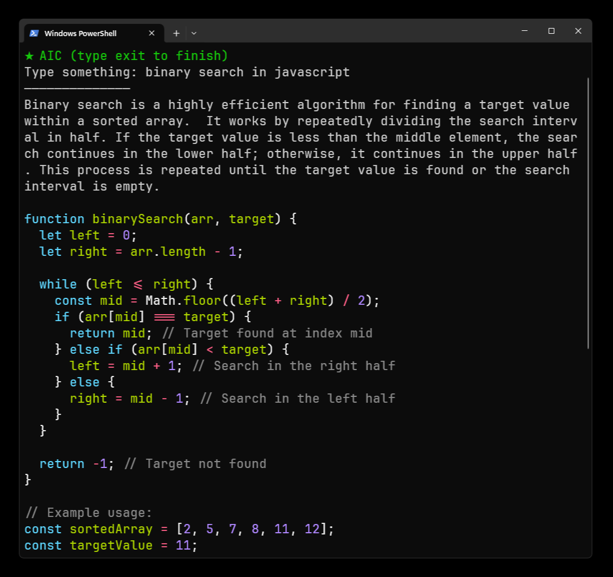

# AIC

>Command line AI



## What's inside?

- Python
- Poetry
- Gemini

## Dev

Install
```sh
poetry run dev
```

Run
```sh
poetry run aic
```

Build
```sh
poetry run pyinstaller --onefile .\aic\__init__.py
```

---

Carlos Costa @ 2024
